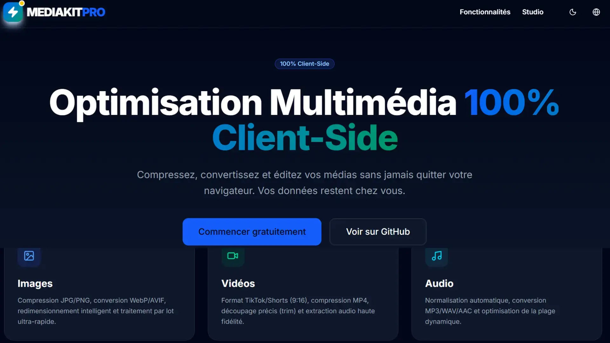

# 🚀 Mediakit Pro

**Mediakit Pro** est une boîte à outils multimédia professionnelle, gratuite et 100% exécutée côté client (client-side). Compressez, convertissez et optimisez vos images, vidéos et fichiers audio directement dans votre navigateur, sans aucun téléchargement vers un serveur.



## ✨ Caractéristiques principales

- **🛡️ 100% Privé & Sécurisé** : Vos fichiers ne quittent jamais votre ordinateur. Tout le traitement est effectué localement via WebAssembly (FFmpeg.wasm).
- **🖼️ Optimisation d'Images** : Convertissez et compressez vos images (JPG, PNG, WebP) avec un contrôle précis de la qualité.
- **🎬 Suite Vidéo** : Compressez, convertissez (MP4, WebM, MOV) et extrayez l'audio de vos vidéos avec des préréglages de vitesse optimisés.
- **🎵 Traitement Audio** : Convertissez et optimisez vos fichiers audio (MP3, WAV, OGG) en toute simplicité.
- **📱 Responsive Design** : Une interface moderne et fluide, parfaitement adaptée aux ordinateurs, tablettes et smartphones.
- **🌓 Mode Sombre/Clair** : Choisissez le thème qui vous convient pour un confort visuel optimal.
- **🌍 Multilingue** : Support complet du Français (par défaut), de l'Anglais et de l'Espagnol.

## 🛠️ Stack Technique

- **Framework** : [Next.js](https://nextjs.org/) (App Router)
- **Style** : [Tailwind CSS](https://tailwindcss.com/)
- **Moteur de traitement** : [FFmpeg.wasm](https://ffmpegwasm.netlify.app/) (WebAssembly)
- **Icônes** : [Lucide React](https://lucide.dev/)
- **Composants UI** : [Radix UI](https://www.radix-ui.com/)
- **Gestion du Thème** : [Next Themes](https://github.com/pacocoursey/next-themes)

## 🚀 Installation Locale

Suivez ces étapes pour faire fonctionner le projet sur votre machine :

1. **Cloner le dépôt** :
   ```bash
   git clone https://github.com/IbansConcept/mediakit-pro.git
   cd mediakit-pro
   ```

2. **Installer les dépendances** :
   ```bash
   npm install
   ```

3. **Lancer le serveur de développement** :
   ```bash
   npm run dev
   ```

4. **Ouvrir le navigateur** :
   Accédez à [http://localhost:3000](http://localhost:3000)

## 🌍 Déploiement

Le projet est déployé en direct sur : [https://mediakit-pro.vercel.app/](https://mediakit-pro.vercel.app/)

Ce projet est optimisé pour être déployé sur **Vercel**. 

**Note importante** : Pour que FFmpeg.wasm fonctionne en production, vous devez vous assurer que les en-têtes de sécurité suivants sont envoyés (généralement gérés automatiquement dans `next.config.mjs`) :
- `Cross-Origin-Embedder-Policy: require-corp`
- `Cross-Origin-Opener-Policy: same-origin`

## 📧 Contact & Support

Pour toute question ou suggestion, n'hésitez pas à nous contacter :
- **Email** : [info@digiprounic.com](mailto:info@digiprounic.com)
- **GitHub** : [IbansConcept](https://github.com/IbansConcept)

---
Développé avec ❤️ pour offrir une confidentialité totale dans le traitement de vos médias.
